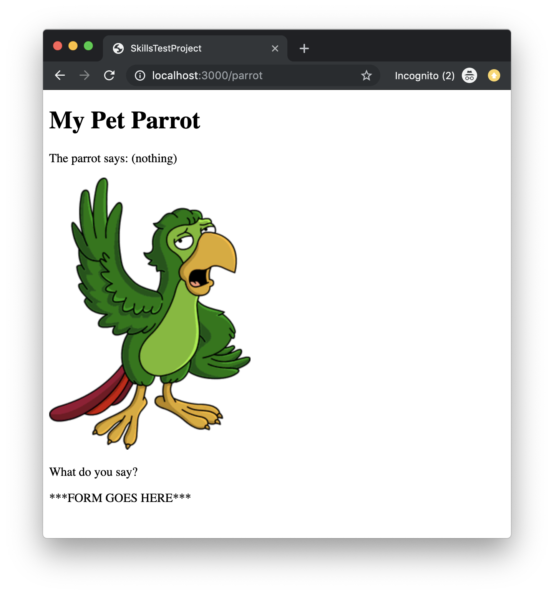
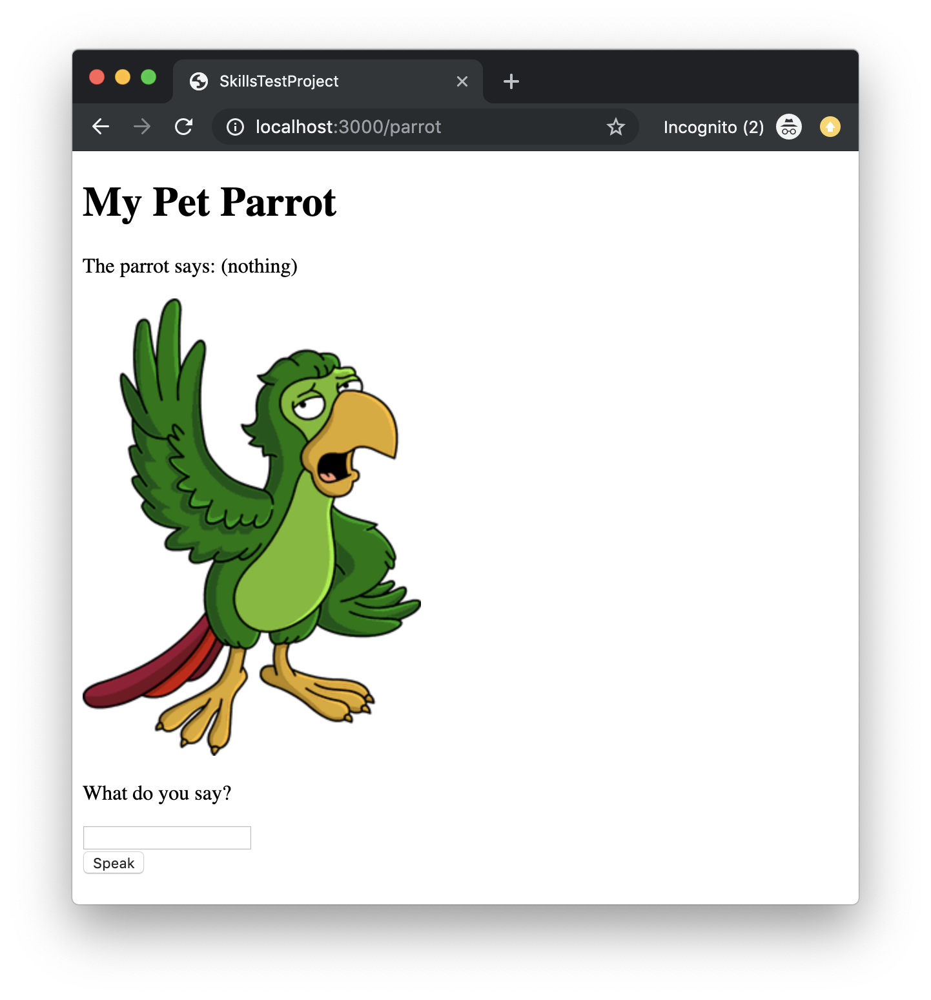

# Skills Test S4, Version B

Be sure that you are familiar with and have completed all the necessary [Skills Test instructions](https://memphis-cs.github.io/comp-4081/skills-test-instructions/) before beginning this test.

## Part 1. Starting the Test

1. Start the screen-capture recording.

1. In your web browser, google the query string "`current time`", so the current time is displayed and captured in the recording.

1. In the terminal, download and checkout the branch for the test:

    ```bash
    git fetch
    git checkout --track origin/s04b
    ```

1. Initialize the project by doing the following:
   1. Install the Gems for the project using `bundle`.
   1. Install the JavaScript dependencies for the project using `yarn`.
   1. Migrate and reset the database using `rails`.

You should now be able to run the Rails web server and view the page <http://localhost:3000/> in your web browser. The page should look like this:



## Part 2. Development Tasks

Update the web app to add a form that looks and functions as follows. When the page is first loaded, it should look like this:



When a user enters and submits data (e.g., "`Hello, world!`") via the form, the response page should look like this (note what the parrot says as well as the emptied form):


In implementing this form/behavior, you must do the following:

- No route exists to handle the form submission. You must create that route. (Before working on this, note what the next item has to say.)

- A controller action does already exist to handle the form submission; however, that action is incomplete. You must complete it.

- The view for the page is missing the form. You must add the form. You must use Rails form helpers to generate the form elements.

## Part 3. Test Submission

Once you've completed all of the above, submit your work by doing the following:

1. Stage and commit all your changes to the local repo.

1. Generate a ZIP archive of your project by running the following command from within the top-level folder of your project's working directory:

    ```bash
    git archive -o ../s04b-submission.zip --prefix=s04b-submission/ HEAD

    ```

    This command should result in a file `s04b-submission.zip` being created in your `workspace` folder.

1. Upload this ZIP file to the [eCourseware](https://elearn.memphis.edu/) dropbox labeled `s04b zip (no video)`.

    **This step must be completed by the end of the test time.**

1. Stop your screen-capture recording such that a video file containing the recording is now created.

1. Upload your video recording to the [eCourseware](https://elearn.memphis.edu/) dropbox labeled `s04b video only`.

    A 15-minute grace period is given beyond the end of the test time for the submission of your video.

1. Close your laptop, and sit quietly until the test period is over. You may **NOT** use your laptop or any device while you wait. However, you may, for example, read a book that you brought with you.
