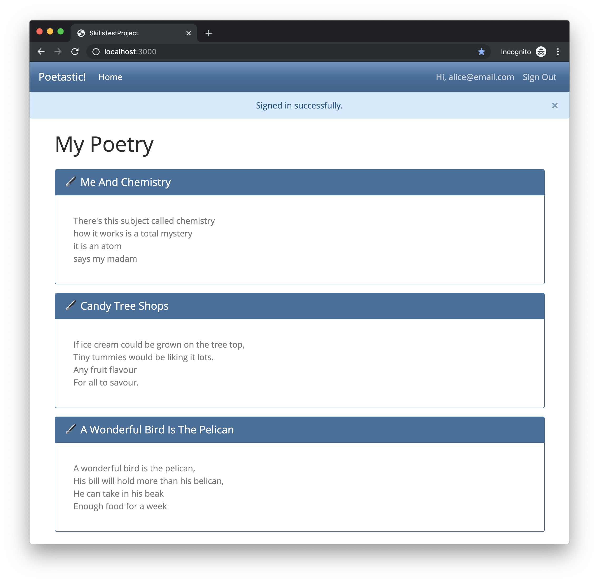
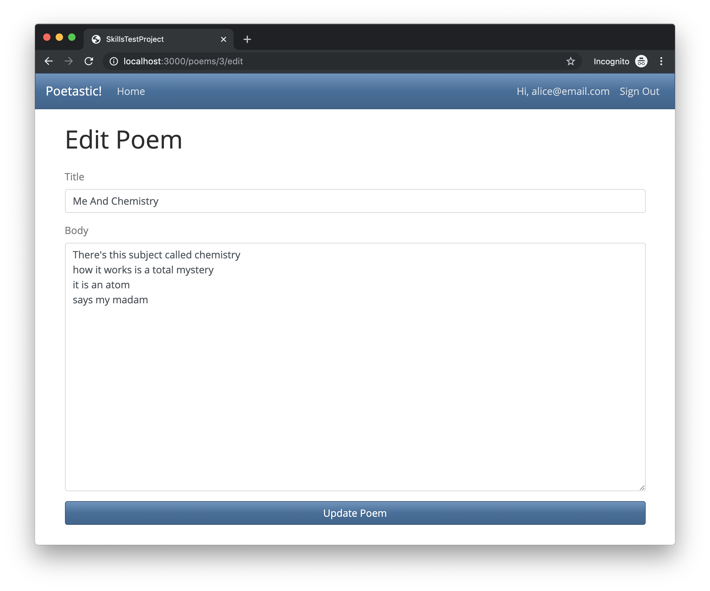
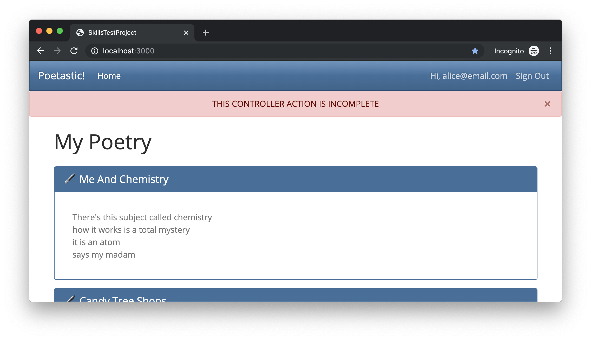

# Skills Test S11-Bonus

Be sure that you are familiar with and have completed all the necessary [Skills Test instructions](https://memphis-cs.github.io/comp-4081/skills-test-instructions/) before beginning this test.

## Part 1. Starting the Test

1. Start the screen-capture recording.

1. In your web browser, google the query string "`current time`", so the current time is displayed and captured in the recording.

1. In the terminal, verify that your working directory is clean:

    ```bash
    git status
    ```

    If there are any uncommitted changes or any untracked files in your working directory, then you will need to do something about them before proceeding. For example, you might simply commit them all these familiar commands:

    ```bash
    git add -A
    git commit -m "Old stuff"
    ```

1. In the terminal, download and checkout the branch for the test:

    ```bash
    git fetch
    git checkout --track origin/s11bonus
    ```

1. Initialize the project by doing the following:
   1. Install the Gems for the project using `bundle`.
   1. Install the JavaScript dependencies for the project using `yarn`.

1. Delete any old junk in the database, and reset it for the current test.

    1. Drop (i.e., delete) all databases (note that this command doesn't change the `schema.rb`):

        ```bash
        rails db:drop
        ```

    1. Create new empty databases (i.e., with no tables):

        ```bash
        rails db:create
        ```

    1. Clear the `schema.rb` file (technically, this command regenerates the `schema.rb` file based on the database, but since our database has no tables, we are effectively using it to clear the `schema.rb` file):

        ```bash
        rails db:schema:dump
        ```

    1. Because we now have an empty `schema.rb` file, we can completely regenerate it, as well as create empty tables in the database, using the following command:

        ```bash
        rails db:migrate
        ```

    1. Finally, seed the database tables with data:

        ```bash
        rails db:seed
        ```

You should now be able to run the Rails web server and view the page <http://localhost:3000/> in your web browser. If you sign in with the email "`alice@email.com`" and the password "`password`", you should see a page that looks like this:



## Part 2. Development Tasks

For this test, you have been given a partially complete Rails app, and it is your job to complete the app.

### The Current State of the (Incomplete) App

Currently, the app has the following:

- A Devise `User` model and Devise sign-up, sign-in, sign-out, etc. pages.
- A `Poem` model class for CRUDing poems.
- An association such that each `User` object has many `Poem` objects, and each `Poem` object belongs to one `User` object.
- Seed data for two users, each having several poems (see `seeds.rb` for details).
- A `HomeController` class with an `index` action that renders an `index.html.erb` view that produces a page that displays the `Poem` records for the currently signed-in user and looks like the above screenshot.
- A `PoemsController` class with an `edit` action that renders an `edit.html.erb` view that produces a form page for updating a `Poem` record and looks like this:

    

The app is incomplete in two key ways:

1. The `PoemsController#update` action is incomplete, and as a consequence, submitting the form does nothing except display the following error flash message:

    

1. The `PoemsController` actions have not been secured properly. Although a user is required to be signed in in order to access the actions, a user can still access the poems of other users. For example, if you are signed in as `alice@email.com`, and you open the URL <http://localhost:3000/poems/5/edit>, a form with a poem that actually belongs to a different user (`bob@email.com`) will be displayed.

### How You Must Complete the App

Your task for this test is to complete this Rails app as follows:

- Complete the `PoemsController#update` action such the the form works properly, in particular:
  - A successful submission of the form should update the model data and redirect the browser back to the root page, displaying a success flash message, "`Poem updated successfully`".
  - An unsuccessful submission of the form (e.g., because form validations failed) should re-render the form page, populating the form with the submitted data and displaying an error flash message, "`Error: Poem could not be updated`".

- Properly secure the `PoemsController` actions, in particular:
  - The signed-in user should be permitted to access the actions only if the `Poem` records to be accessed actually belong to that user.
  - If a user attempts to access `Poem` records that do not belong to that user, then the app should redirect the browser to the root page, displaying an error flash message, "`Error: You do not have permission to do that`".

Hint: To complete this task, you should need only to modify the `PoemsController` class.

## Part 3. Test Submission

Once you've completed all of the above, submit your work by doing the following:

1. Commit all your changes to the local repo.

1. Generate a ZIP archive of your project by running the following command from within the top-level folder of your project's working directory:

    ```bash
    git archive -o ../s11bonus-submission.zip --prefix=s11bonus-submission/ HEAD
    ```

    This command should result in a file `s11bonus-submission.zip` being created in your `workspace` folder.

1. Upload this ZIP file to the [eCourseware](https://elearn.memphis.edu/) dropbox labeled `s11bonus zip (no video)`.

    **This step must be completed by the end of the test time.**

1. Stop your screen-capture recording such that a video file containing the recording is now created.

1. Upload your video recording to the [eCourseware](https://elearn.memphis.edu/) dropbox labeled `s11bonus video only`.

    A 15-minute grace period is given beyond the end of the test time for the submission of your video.

1. Close your laptop, and sit quietly until the test period is over. You may **NOT** use your laptop or any device while you wait. However, you may, for example, read a book that you brought with you.
