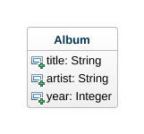

# Skills Test S5, Version A

Be sure that you are familiar with and have completed all the necessary [Skills Test instructions](https://memphis-cs.github.io/comp-4081/skills-test-instructions/) before beginning this test.

## Part 1. Starting the Test

1. Start the screen-capture recording.

1. In your web browser, google the query string "`current time`", so the current time is displayed and captured in the recording.

1. In the terminal, download and checkout the branch for the test:

    ```bash
    git fetch
    git checkout --track origin/s05a
    ```

1. Initialize the project by doing the following:
   1. Install the Gems for the project using `bundle`.
   1. Install the JavaScript dependencies for the project using `yarn`.
   1. Migrate and reset the database using `rails`.

Don't run the Rails server yet.

## Part 2. Development Tasks

For this test, you have been given a partially complete web app, and it is your job to finish it. Doing so will involve only two tasks:

1. Generate a model class using `rails` that exactly matches this class diagram:

    

    Once you've generated the model, run the database migrations to update the database schema.

1. Write code to create the following seed records for the database.

    | title | artist | year  |
    | ----- | ------ | ----- |
    | Back in Black | AC/DC | 1980 |
    | Hysteria | Def Leppard | 1987 |
    | 1984 | Van Halen | 1984 |

    Once you've written the code to create these records, actually seed the database by running the appropriate `rails` command.

If you complete both of the above tasks correctly, you should be able to open the webpage <http://localhost:3000/albums> that displays a table of all the `Album` objects.

**Take a screenshot that shows the page (including the entire browser window), and save it with the file name `SCREENSHOT` (and whatever file suffix is appropriate).**

## Part 3. Test Submission

Once you've completed all of the above, submit your work by doing the following:

1. Commit your screenshot and all your changes to the local repo.

1. Generate a ZIP archive of your project by running the following command from within the top-level folder of your project's working directory:

    ```bash
    git archive -o ../s05a-submission.zip --prefix=s05a-submission/ HEAD

    ```

    This command should result in a file `s05a-submission.zip` being created in your `workspace` folder.

1. Upload this ZIP file to the [eCourseware](https://elearn.memphis.edu/) dropbox labeled `s05a zip (no video)`.

    **This step must be completed by the end of the test time.**

1. Stop your screen-capture recording such that a video file containing the recording is now created.

1. Upload your video recording to the [eCourseware](https://elearn.memphis.edu/) dropbox labeled `s05a video only`.

    A 15-minute grace period is given beyond the end of the test time for the submission of your video.

1. Close your laptop, and sit quietly until the test period is over. You may **NOT** use your laptop or any device while you wait. However, you may, for example, read a book that you brought with you.
