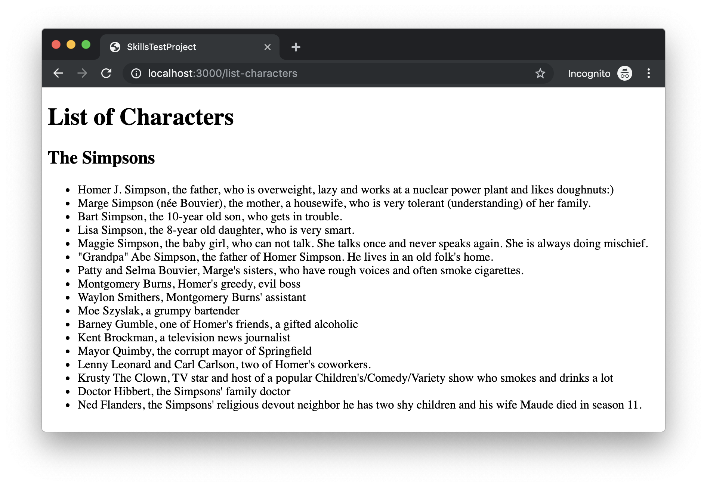

# Skills Test S3, Version A

Be sure that you are familiar with have completed all the necessary [Skills Test instructions](https://memphis-cs.github.io/comp-4081/skills-test-instructions/) before beginning this test.

For this test, you must do the following:

1. Initialize the project by doing the following:

    - Install the Gems for the project using `bundle`, and install the JavaScript dependencies for the project using `yarn`.

    - Migrate and reset the database using `rails`.

    You should now be able to run the Rails web server and view the page <http://localhost:3000/> in your web browser. The page should consist only of the heading "Limerick of the Day".

1. Update the web page such that it looks exactly like the screenshot below, subject to the following additional requirements:

    - The controller action that renders the page contains local variables `title` (the title of a limerick) and `lines` (the lines of a limerick). Your solution must pass these variables from the controller to the view for the page.

    - The view must display the values of the variables as shown in the screenshot. If the controller action variables' values were changed, then the web page should automatically be updated to reflect the change. The view must be able to display a limerick with an unbounded number of lines.

    - In updating the page, you must add the following HTML elements: `h2`, `li`, and `ul`.

    - You should reuse as much of the code that is already there as possible. That is, don't add any new controllers, controller actions, etc.

    **Take a screenshot that shows the page (including the entire browser window), and save it with the file name `SCREENSHOT` (and whatever file suffix is appropriate).**

Once you've completed all of the above, commit all your changes to the local repo (including the screenshot), and push your commit to GitHub. Upload your `.flv` video recording to the eCourseware dropbox labeled `Skills Test S3, Version A`.

