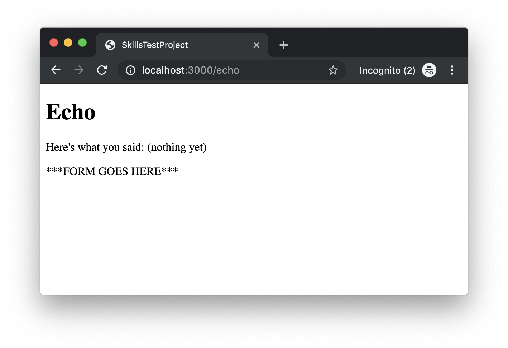
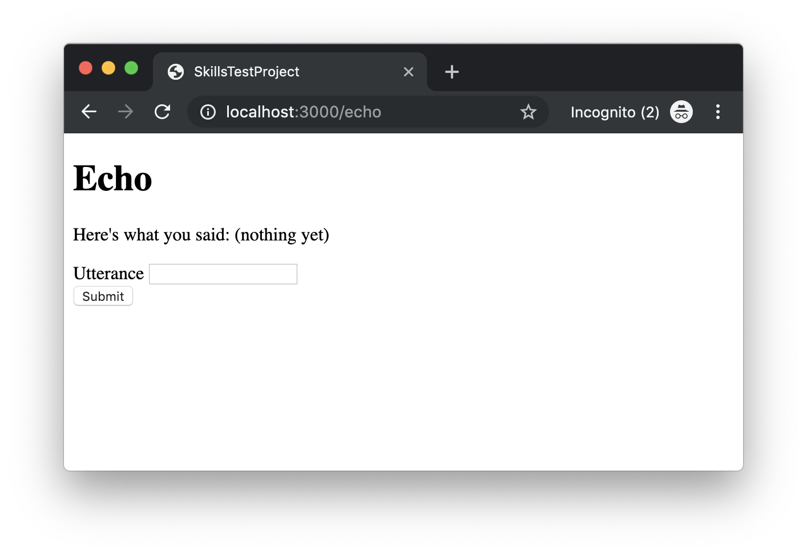

# Skills Test S4, Version A

Be sure that you are familiar with have completed all the necessary [Skills Test instructions](https://memphis-cs.github.io/comp-4081/skills-test-instructions/) before beginning this test.

## Part 1. Project Initialization

Initialize the project by doing the following:

- Install the Gems for the project using `bundle`, and install the JavaScript dependencies for the project using `yarn`.

- Migrate and reset the database using `rails`.

You should now be able to run the Rails web server and view the page <http://localhost:3000/> in your web browser. The page should look like this:



## Part 2. Development Tasks

Update the web app to add a form that looks and functions as follows. When the page is first loaded, it should look like this:



When a user enters and submits data via the form, the response page should look like this (note the echoed text and the empty form):


In implementing this form/behavior, you must do the following:

- No route exists to handle the form submission. You must create that route.

- A controller action does already exist to handle the form submission; however, that action is incomplete. You must complete it.

- The view for the page is missing the form. You must add the form. You must use Rails form helpers to generate the form elements.

## Part 3. Test Submission

Once you've completed all of the above, submit your work by doing the following:

1. Stage and commit all your changes to the local repo.

1. Generate a ZIP archive of your project by running the following command from within the top-level folder of your project's working directory:

    ```bash
    git archive -o ../s04a-submission.zip --prefix=s04a-submission/ HEAD

    ```

    This command should result in a file `s04a-submission.zip` being created in your `workspace` folder.

1. Upload this ZIP file to the [eCourseware](https://elearn.memphis.edu/) dropbox labeled `s04a zip (no video)`.

    **This step must be completed by the end of the test time.**

1. Stop your screen-capture recording such that a video file containing the recording is now created.

1. Upload your video recording to the [eCourseware](https://elearn.memphis.edu/) dropbox labeled `s04a video only`.

    A 15-minute grace period is given beyond the end of the test time for the submission of your video.
