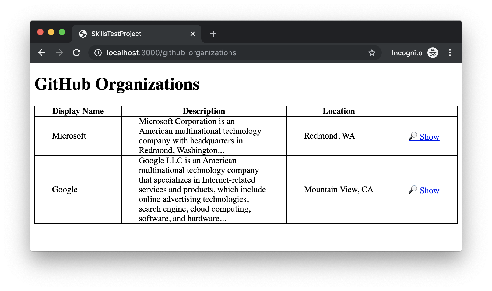
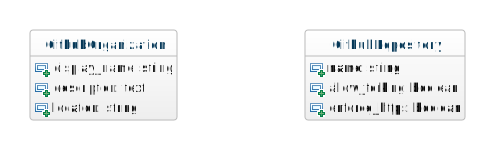
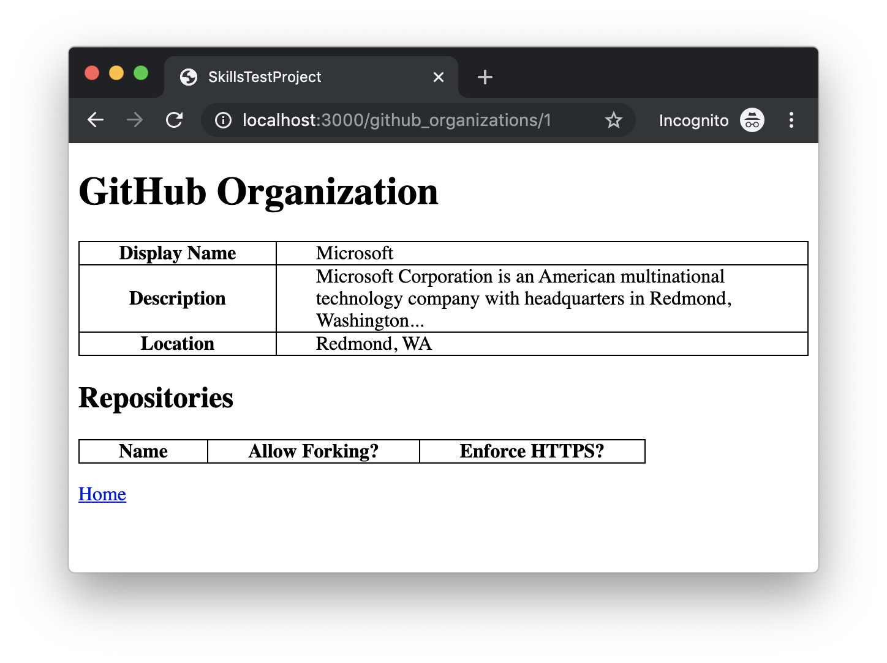
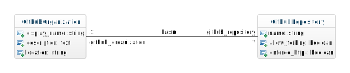
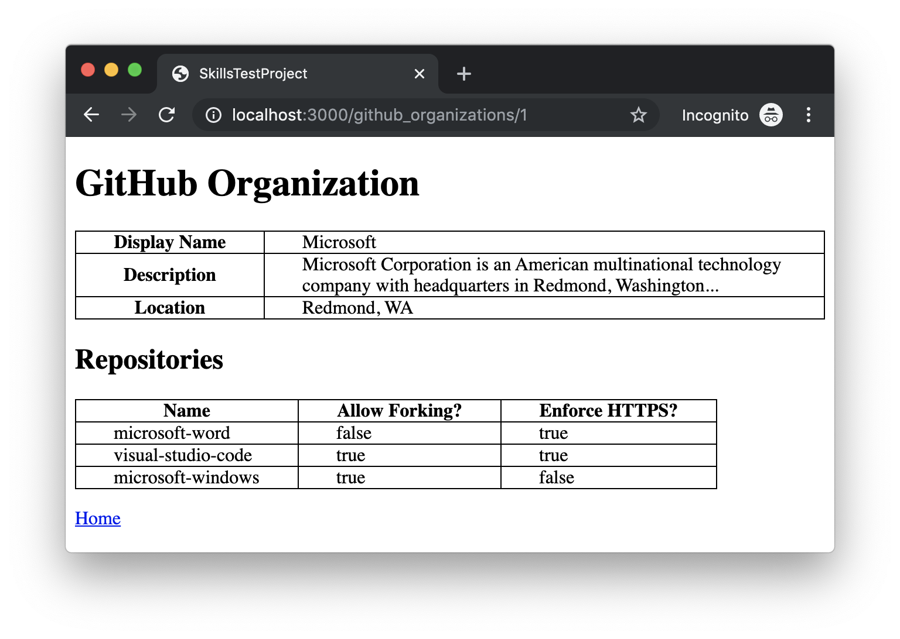

# Skills Test S9, Version B

Be sure that you are familiar with and have completed all the necessary [Skills Test instructions](https://memphis-cs.github.io/comp-4081/skills-test-instructions/) before beginning this test.

## Part 1. Starting the Test

1. Start the screen-capture recording.

1. In your web browser, google the query string "`current time`", so the current time is displayed and captured in the recording.

1. In the terminal, verify that your working directory is clean:

    ```bash
    git status
    ```

    If there are any uncommitted changes or any untracked files in your working directory, then you will need to do something about them before proceeding. For example, you might simply commit them all these familiar commands:

    ```bash
    git add -A
    git commit -m "Old stuff"
    ```

1. In the terminal, download and checkout the branch for the test:

    ```bash
    git fetch
    git checkout --track origin/s09b
    ```

1. Initialize the project by doing the following:
   1. Install the Gems for the project using `bundle`.
   1. Install the JavaScript dependencies for the project using `yarn`.

1. Delete any old junk in the database, and reset it for the current test.

    1. Drop (i.e., delete) all databases (note that this command doesn't change the `schema.rb`):

        ```bash
        rails db:drop
        ```

    1. Create new empty databases (i.e., with no tables):

        ```bash
        rails db:create
        ```

    1. Clear the `schema.rb` file (technically, this command regenerates the `schema.rb` file based on the database, but since our database has no tables, we are effectively using it to clear the `schema.rb` file):

        ```bash
        rails db:schema:dump
        ```

    1. Because we now have an empty `schema.rb` file, we can completely regenerate it, as well as create empty tables in the database, using the following command:

        ```bash
        rails db:migrate
        ```

    1. Finally, seed the database tables with data:

        ```bash
        rails db:seed
        ```

You should now be able to run the Rails web server and view the page <http://localhost:3000/> in your web browser. You should see an `index` page that looks like this:



## Part 2. Development Tasks

For this test, you have been given a partially complete Rails app, and it is your job to complete the app.

### The Current State of the (Incomplete) App

Currently, the app has the following two models:



In its current (incomplete) state, the app works as follows.

On the `index` page, when the user clicks the `🔎Show` link, a partially implemented `show` page is displayed. For example, if you clicked the `🔎Show` link next to the first record in the table, you would see a `show` page that looks like this:



### How You Must Complete the App

Your task for this test is to complete this Rails app such that a one-to-many association between the existing model classes is added, as depicted in this class diagram:



Once this association is added, the seed data must be updated to use the association, and the `show` page must be updated to display associated records, like this:



Hint: To complete this task, you should need to

- create a new migration that adds an FK column,
- update the existing model classes,
- update the existing database seeds, and
- update the existing `show` view.

## Part 3. Test Submission

Once you've completed all of the above, submit your work by doing the following:

1. Commit all your changes to the local repo.

1. Generate a ZIP archive of your project by running the following command from within the top-level folder of your project's working directory:

    ```bash
    git archive -o ../s09b-submission.zip --prefix=s09b-submission/ HEAD
    ```

    This command should result in a file `s09b-submission.zip` being created in your `workspace` folder.

1. Upload this ZIP file to the [eCourseware](https://elearn.memphis.edu/) dropbox labeled `s09b zip (no video)`.

    **This step must be completed by the end of the test time.**

1. Stop your screen-capture recording such that a video file containing the recording is now created.

1. Upload your video recording to the [eCourseware](https://elearn.memphis.edu/) dropbox labeled `s09b video only`.

    A 15-minute grace period is given beyond the end of the test time for the submission of your video.

1. Close your laptop, and sit quietly until the test period is over. You may **NOT** use your laptop or any device while you wait. However, you may, for example, read a book that you brought with you.
